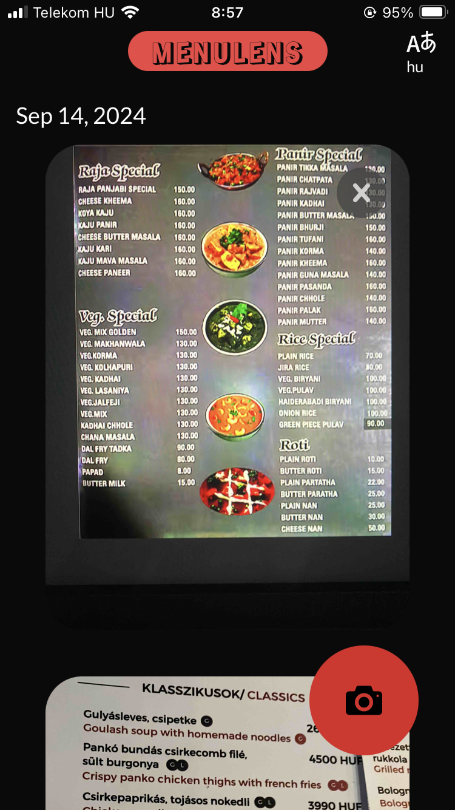
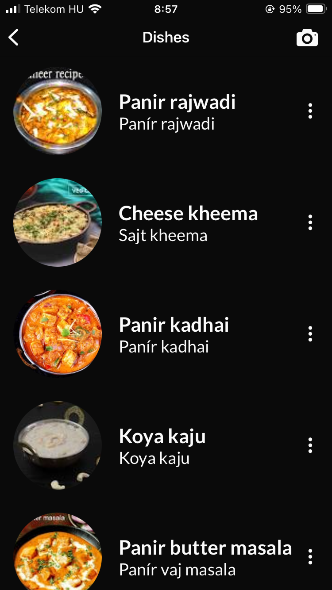
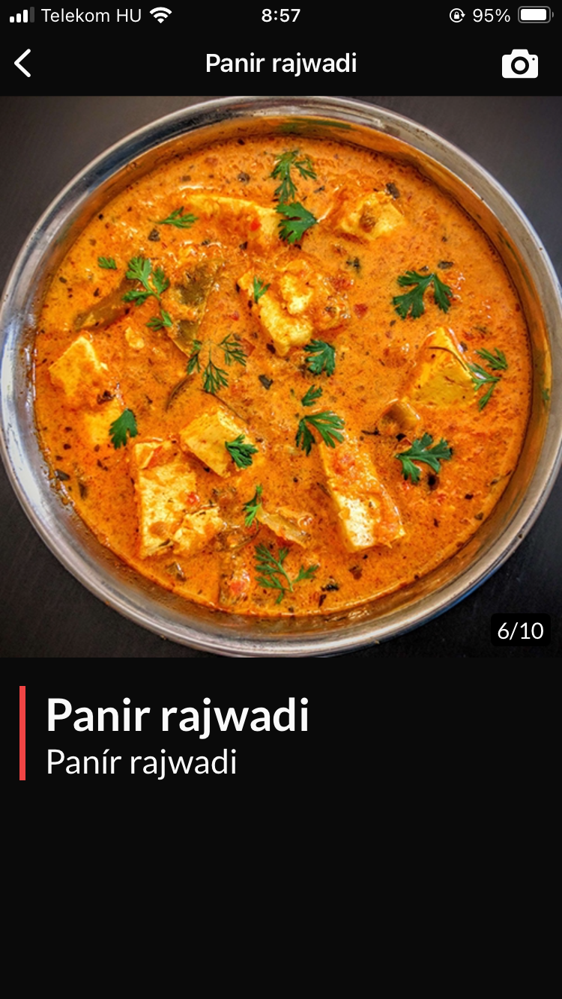
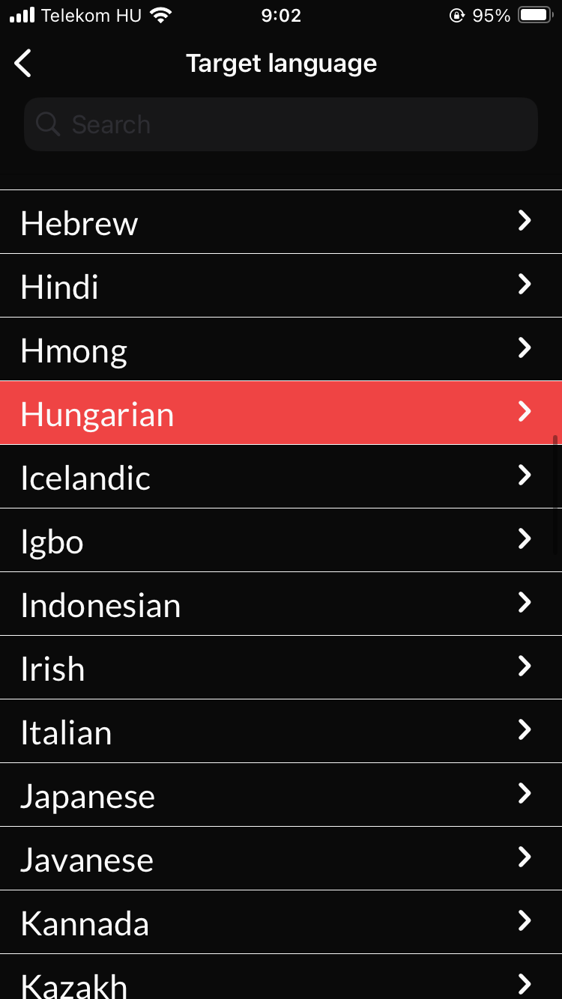

# Menu Lens

## About

This is a cross platform mobile app currently in development where users can take photos of restaurant menus and receive images of the recognized food items to faciliate their meal choices.

The application relies on Google's Text Recognition and Image Search services, as well as OpenAI's capabilities to parse and translate text from the restaurant menus.

## Media

### Landing screen with list of restaurant menu pages

### List of recognized dishes

### Images for the dishes along with translations

### Language selector for translations

